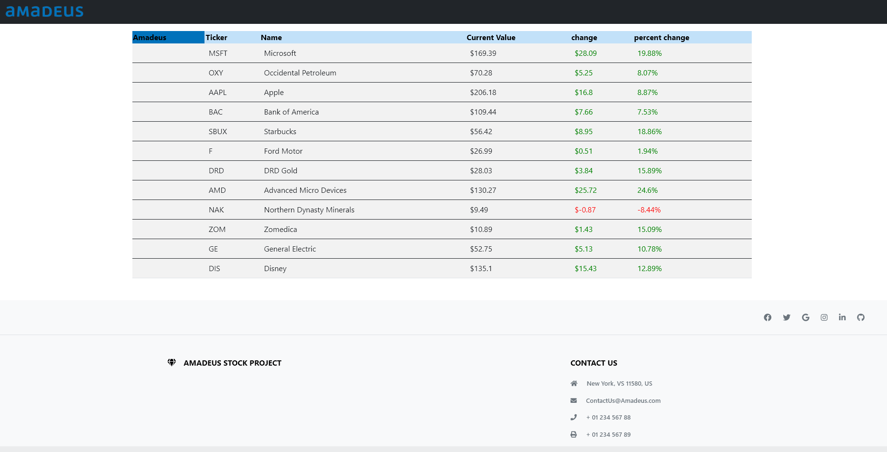
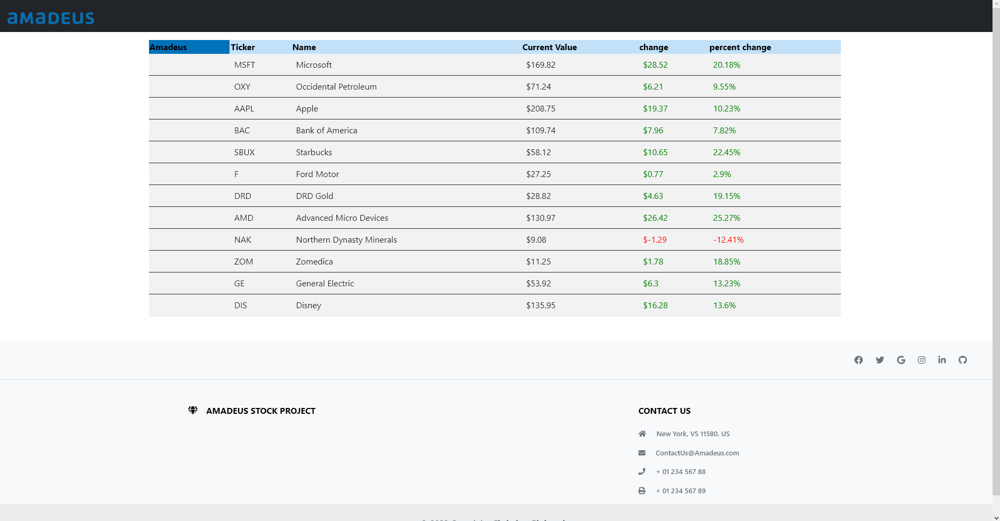
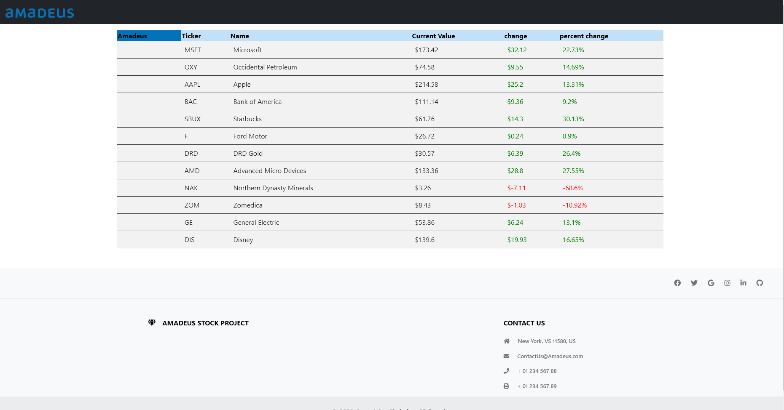

    </img>
	<h1 align="center">Stock App</h1>
    

    

     </img>

<a>
This project works by first starting the stock price randomization in a static block before any interaction can be had with the server. Then a user can open their webpage and see up to date information with stock prices and their changes relative to the last closing or opening price. This program makes use of multi-threading by allowing the randomization to recursively call itself every 10 seconds apart from all other server interactions.
</a>
  

Data is sent through Ajax requests. Data is only updated and calculated through the backend if the data has changed. If not, it will remain the same, bypassing any calculations but still sending a complete set of data. The front end then receives the data and displays the color data based on change values. The data in the front end is constantly overwritten by new data coming from the server on an interval that can be changed depending on what would be best. Colors are updated via a small script that reads incoming price changes and makes a color array based on if they are negative, zero, or positive.  

   

Sorting uses a few scripts to see if the list is already being sorted, what type of sort should be done, and what column should be sorted. The HTML interacts with angular’s NG calls and allows for a dynamic feel.  

<h1> Changing prices:</h1><a> (image is of older UI from day 2 of development) </a>
   </img>
   </img>
   </img>

